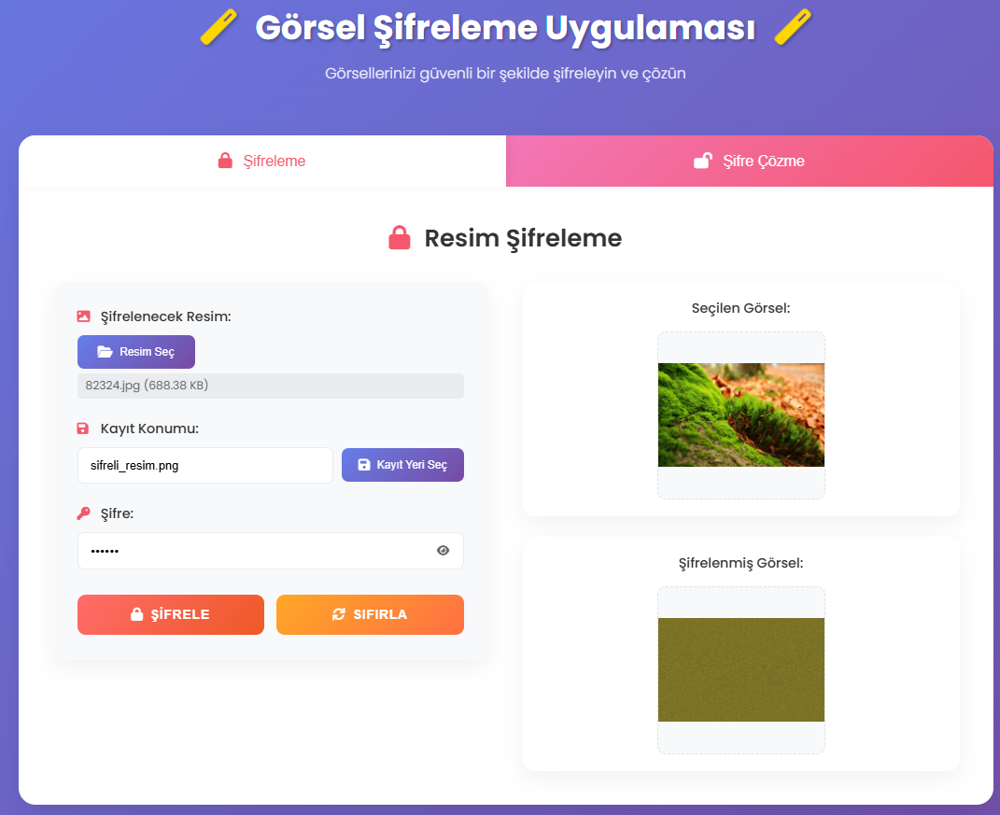
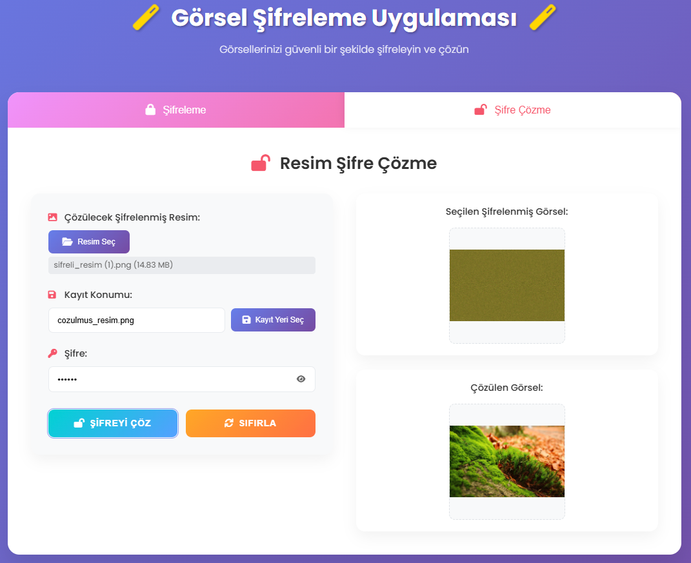

# 🔐 Görsel Şifreleme Uygulaması

> Görsellerinizi güvenli bir şekilde şifreleyin ve çözün - Modern web arayüzü ile!



## 📋 İçindekiler

- [Proje Hakkında](#-proje-hakkında)
- [Özellikler](#-özellikler)
- [Teknolojiler](#-teknolojiler)
- [Kurulum](#-kurulum)
- [Kullanım](#-kullanım)
- [API Dokümantasyonu](#-api-dokümantasyonu)
- [Ekran Görüntüleri](#-ekran-görüntüleri)
- [Katkıda Bulunma](#-katkıda-bulunma)
- [Lisans](#-lisans)

## 🎯 Proje Hakkında

Görsel Şifreleme Uygulaması, dijital görsellerinizi güvenli bir şekilde şifreleyip çözmenizi sağlayan modern bir web uygulamasıdır. Uygulama, pixel karıştırma algoritması kullanarak görsellerinizi şifreler ve sadece doğru şifre ile çözülebilir hale getirir.

### 🚀 Projenin Amacı

- **Gizlilik**: Özel görsellerinizi güvenli bir şekilde saklayın
- **Güvenlik**: Güçlü şifreleme algoritması ile verilerinizi koruyun
- **Kullanım Kolaylığı**: Modern ve sezgisel web arayüzü
- **Erişilebilirlik**: Herhangi bir cihazdan kullanılabilir
- **Açık Kaynak**: Şeffaf ve güvenilir kod yapısı

## ✨ Özellikler

### 🔒 Şifreleme Özellikleri
- **Pixel Karıştırma**: Gelişmiş algoritma ile görsel piksellerini karıştırır
- **Şifre Tabanlı**: Kullanıcı tanımlı şifre ile güvenlik
- **Kayıpsız Sıkıştırma**: PNG formatında kalite kaybı olmadan kaydetme
- **Çoklu Format Desteği**: JPG, PNG, BMP formatlarını destekler

### 🎨 Kullanıcı Arayüzü
- **Modern Tasarım**: Gradient arka planlar ve smooth animasyonlar
- **Responsive**: Tüm cihazlarda mükemmel görünüm
- **Drag & Drop**: Dosyaları sürükleyip bırakma desteği
- **Canlı Önizleme**: Seçilen görsellerin anında görüntülenmesi
- **Bildirim Sistemi**: Başarı/hata mesajları için modern popup'lar

### ⚡ Performans
- **Hızlı İşlem**: Optimize edilmiş algoritma
- **Otomatik İndirme**: İşlem sonrası dosyaların otomatik indirilmesi
- **Klavye Kısayolları**: Ctrl+1 (şifreleme), Ctrl+2 (şifre çözme)
- **Hata Yönetimi**: Kapsamlı hata yakalama ve kullanıcı bildirimi

## 🛠 Teknolojiler

### Frontend
- **HTML5**: Modern web standartları
- **CSS3**: Flexbox, Grid, Animations
- **Vanilla JavaScript**: Framework bağımsız, hızlı performans
- **Font Awesome**: İkon kütüphanesi

### Backend
- **Flask**: Python web framework
- **OpenCV**: Görüntü işleme kütüphanesi
- **NumPy**: Matematiksel işlemler
- **Pillow**: Görüntü manipülasyonu

### Diğer
- **CORS**: Cross-origin resource sharing
- **RESTful API**: Modern API tasarımı

## 📦 Kurulum

### Gereksinimler
- Python 3.7+
- pip (Python paket yöneticisi)
- Modern web tarayıcısı

### Adım 1: Projeyi İndirin
```bash
git clone https://github.com/kullaniciadi/gorsel-sifreleme.git
cd gorsel-sifreleme
```

### Adım 2: Sanal Ortam Oluşturun (Önerilen)
```bash
python -m venv venv

# Windows
venv\Scripts\activate

# macOS/Linux
source venv/bin/activate
```

### Adım 3: Bağımlılıkları Yükleyin
```bash
pip install -r requirements.txt
```

### Adım 4: Uygulamayı Başlatın
```bash
python app.py
```

### Adım 5: Tarayıcıda Açın
Tarayıcınızda `http://localhost:8080` adresine gidin.

## 🎮 Kullanım

### Görsel Şifreleme
1. **Şifreleme** sekmesine tıklayın
2. "Resim Seç" butonuna tıklayın veya görseli sürükleyip bırakın
3. Güçlü bir şifre girin
4. "ŞİFRELE" butonuna tıklayın
5. Şifrelenmiş görsel otomatik olarak indirilir



### Şifre Çözme
1. **Şifre Çözme** sekmesine tıklayın
2. Şifrelenmiş görseli seçin
3. Şifreleme sırasında kullandığınız şifreyi girin
4. "ŞİFREYİ ÇÖZ" butonuna tıklayın
5. Çözülmüş görsel otomatik olarak indirilir

### Klavye Kısayolları
- `Ctrl + 1`: Şifreleme sekmesine geç
- `Ctrl + 2`: Şifre çözme sekmesine geç
- `Escape`: Loading ekranını kapat

## 📡 API Dokümantasyonu

### Şifreleme Endpoint'i
```http
POST /api/encrypt
Content-Type: multipart/form-data

Parameters:
- image: File (JPG, PNG, BMP)
- password: String

Response:
- Success: Şifrelenmiş görsel dosyası
- Error: JSON hata mesajı
```

### Şifre Çözme Endpoint'i
```http
POST /api/decrypt
Content-Type: multipart/form-data

Parameters:
- image: File (Şifrelenmiş görsel)
- password: String

Response:
- Success: Çözülmüş görsel dosyası
- Error: JSON hata mesajı
```

### Sağlık Kontrolü
```http
GET /api/health

Response:
{
  "status": "healthy",
  "message": "Görüntü şifreleme servisi çalışıyor"
}
```

## 📸 Ekran Görüntüleri

### Ana Sayfa
Modern ve kullanıcı dostu arayüz ile kolay navigasyon.

### Şifreleme İşlemi
Sürükle-bırak desteği ile hızlı dosya seçimi ve güvenli şifreleme.

### Şifre Çözme İşlemi
Şifrelenmiş görselleri kolayca çözün ve orijinal haline döndürün.

## 🔧 Geliştirme

### Proje Yapısı
```
gorsel-sifreleme/
├── app.py              # Flask backend uygulaması
├── index.html          # Ana HTML dosyası
├── styles.css          # CSS stilleri
├── script.js           # JavaScript işlevleri
├── requirements.txt    # Python bağımlılıkları
├── README.md          # Proje dokümantasyonu
├── sifreleme.png      # Şifreleme ekran görüntüsü
├── sifre_cozme.png    # Şifre çözme ekran görüntüsü
└── birlesik_uygulama.py # Eski Flet uygulaması (referans)
```

### Algoritma Detayları
1. **Şifreleme**: Görsel piksellerini şifre tabanlı rastgele sırayla karıştırır
2. **Çözme**: Aynı şifre ile karıştırma işlemini tersine çevirir
3. **Güvenlik**: Şifre olmadan orijinal görseli elde etmek imkansızdır

## 🤝 Katkıda Bulunma

1. Bu repository'yi fork edin
2. Feature branch oluşturun (`git checkout -b feature/AmazingFeature`)
3. Değişikliklerinizi commit edin (`git commit -m 'Add some AmazingFeature'`)
4. Branch'inizi push edin (`git push origin feature/AmazingFeature`)
5. Pull Request oluşturun

### Geliştirme Kuralları
- Kod kalitesini koruyun
- Yorum satırları ekleyin
- Test yazın
- Dokümantasyonu güncelleyin

## 📄 Lisans

Bu proje MIT lisansı altında lisanslanmıştır. Detaylar için `LICENSE` dosyasına bakın.


---

⭐ Bu projeyi beğendiyseniz yıldız vermeyi unutmayın!

**Not**: Bu uygulama eğitim amaçlıdır. Kritik veriler için profesyonel şifreleme çözümleri kullanın.
